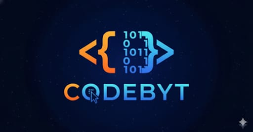

# CODEBYT - Digital Innovation Agency

A modern, high-performance website for CODEBYT, a full-service technology powerhouse specializing in digital transformation, AI solutions, and innovative software development.



## 🌟 Features

- **Modern UI/UX**: Built with a sleek, professional design featuring glass morphism effects and smooth animations
- **Responsive Design**: Fully responsive across all devices (mobile, tablet, desktop)
- **Performance Optimized**: Fast loading times with optimized assets and code splitting
- **SEO Friendly**: Built with best SEO practices for better search engine visibility
- **Interactive Animations**: Smooth scroll animations powered by Framer Motion
- **Contact Form Integration**: Integrated with Formspree for seamless lead generation
- **Dark Mode Support**: Modern dark theme with careful attention to contrast and readability

## 🚀 Tech Stack

### Frontend
- **React 18.3** - UI library
- **TypeScript** - Type safety
- **Vite** - Build tool and dev server
- **React Router** - Client-side routing
- **Framer Motion** - Animation library
- **Tailwind CSS** - Utility-first styling

### UI Components
- **shadcn/ui** - Beautifully designed components
- **Radix UI** - Accessible component primitives
- **Lucide React** - Icon library

### State Management & Forms
- **React Query** - Server state management
- **React Hook Form** - Form handling
- **Zod** - Schema validation

### Testing
- **Vitest** - Unit testing framework
- **Playwright** - E2E testing
- **Testing Library** - React testing utilities

## 📂 Project Structure

```
CODEBYT/
├── public/                 # Static assets
│   ├── harit.jpeg         # Team member images
│   ├── harshit.jpg
│   ├── mukesh img01.jpeg
│   ├── logo.jpg
│   └── ...
├── src/
│   ├── components/
│   │   ├── home/          # Homepage sections
│   │   │   ├── HeroSection.tsx
│   │   │   ├── ServicesSection.tsx
│   │   │   ├── ContactFormSection.tsx
│   │   │   └── ...
│   │   ├── ui/            # Reusable UI components
│   │   │   ├── button.tsx
│   │   │   ├── card.tsx
│   │   │   └── ...
│   │   ├── Footer.tsx
│   │   ├── Navbar.tsx
│   │   └── Layout.tsx
│   ├── pages/             # Page components
│   │   ├── Index.tsx      # Home page
│   │   ├── About.tsx
│   │   ├── Services.tsx
│   │   ├── Portfolio.tsx
│   │   ├── Client.tsx
│   │   ├── Contact.tsx
│   │   └── NotFound.tsx
│   ├── lib/               # Utilities
│   │   └── utils.ts
│   ├── hooks/             # Custom hooks
│   ├── App.tsx            # Main app component
│   └── main.tsx           # Entry point
├── package.json
├── tailwind.config.ts
├── vite.config.ts
└── tsconfig.json
```

## 🎯 Pages & Routes

- **Home (`/`)** - Hero section, services overview, testimonials, process, and contact form
- **About (`/about`)** - Company story, values, and leadership team with LinkedIn profiles
- **Services (`/services`)** - Detailed service offerings (Web Dev, Mobile Apps, AI, Cloud, etc.)
- **Portfolio (`/portfolio`)** - Showcase of completed projects
- **Clients (`/clients`)** - Client testimonials and success stories
- **Contact (`/contact`)** - Contact form and FAQ section

## 🛠️ Development

### Prerequisites

- Node.js 18+ 
- npm or bun package manager

### Installation

1. Clone the repository:
```bash
git clone <repository-url>
cd CODEBYT
```

2. Install dependencies:
```bash
npm install
# or
bun install
```

3. Start the development server:
```bash
npm run dev
# or
bun run dev
```

The application will be available at `http://localhost:8080`

### Build

```bash
npm run build
# or
bun run build
```

### Preview Production Build

```bash
npm run preview
```

### Run Tests

```bash
# Unit tests
npm run test

# Watch mode
npm run test:watch
```

### Linting

```bash
npm run lint
```

## 🚀 Deployment

### Deploy to Azure (Recommended)

Your project is **fully configured** for Azure deployment with automated scripts and comprehensive documentation.

#### ⚡ Quick Deploy (Under 10 Minutes)

**Windows:**
```bash
deploy-azure.bat
```

**Linux/Mac:**
```bash
chmod +x deploy-azure.sh
./deploy-azure.sh
```

#### 📋 Prerequisites

- Azure Account (create free at https://azure.microsoft.com/free)
- Azure CLI installed (`az --version`)
- Node.js 18+
- Git installed

#### 🔧 Manual Deployment to Azure Static Web Apps

```bash
# 1. Install dependencies
npm install

# 2. Build for production
npm run build

# 3. Login to Azure
az login

# 4. Install Static Web Apps extension
az extension add --name staticwebapp

# 5. Deploy
az staticwebapp create \
  --name codebyte-website \
  --resource-group codebyte-rg \
  --source . \
  --location eastus \
  --branch main \
  --app-location "/" \
  --output-location "dist"
```

#### 📁 Configuration Files

All Azure configuration is already set up:

- **`staticwebapp.config.json`** - SPA routing, security headers, caching policies
- **`web.config`** - IIS configuration for Windows hosting
- **`azure-app.yaml`** - App Service configuration
- **`deployment.json`** - Deployment metadata

#### 💰 Cost Estimate

**Azure Static Web Apps (Free Tier):**
- ✅ FREE for personal projects
- ✅ Includes SSL certificate
- ✅ Automatic deployments from Git
- ✅ Custom domains supported
- ❌ Limited to 3 environments

**Azure App Service (B1 Basic):** ~$13/month
- More control and flexibility
- Auto-scaling, deployment slots

#### ✅ Post-Deployment Checklist

After deployment, verify:

- [ ] Site loads without errors
- [ ] All pages accessible (/, /about, /services, /portfolio, /clients, /contact)
- [ ] Images load properly
- [ ] Contact form works
- [ ] Mobile responsive design works
- [ ] No console errors
- [ ] HTTPS enabled (green padlock)
- [ ] Lighthouse score > 90

#### 🔄 Other Deployment Methods

**Azure App Service (More Control):**
```bash
# Create resource group
az group create --name codebyte-rg --location eastus

# Create App Service Plan
az appservice plan create \
  --name codebyte-plan \
  --resource-group codebyte-rg \
  --sku B1 \
  --is-linux

# Create Web App
az webapp create \
  --resource-group codebyte-rg \
  --plan codebyte-plan \
  --name codebyte-webapp \
  --runtime "NODE|18-lts" \
  --deployment-local-git

# Configure and deploy
az webapp config appsettings set \
  --resource-group codebyte-rg \
  --name codebyte-webapp \
  --settings SCM_DO_BUILD_DURING_DEPLOYMENT=true

git remote add azure <DEPLOYMENT_URL>
git push azure main
```

**Azure Storage (Low Cost):**
1. Create Storage Account in Azure Portal
2. Enable "Static website" in settings
3. Upload contents of `dist` folder to `$web` container
4. Access via provided endpoint URL

#### 🆘 Troubleshooting

**Build fails:**
```bash
# Clear cache and reinstall
rm -rf node_modules package-lock.json
npm install
npm run build
```

**404 on page refresh:**
- This is normal for SPAs
- Ensure `staticwebapp.config.json` or `web.config` is present

**Assets not loading:**
- Check that all asset paths are relative
- Verify build output in `dist/` folder

#### 📊 Monitoring & Analytics

Enable Application Insights:
```bash
az monitor app-insights component create \
  --app codebyte-insights \
  --location eastus \
  --resource-group codebyte-rg \
  --application-type web
```

#### 🎯 Next Steps After Deployment

1. **Add Custom Domain** (Optional)
   - Go to Azure Portal → Your Static Web App → Custom domains
   - Configure DNS records
   - SSL auto-provisioned

2. **Set Up CI/CD** (Recommended)
   - Connect GitHub repository
   - Automatic deployments on push

3. **Configure Environment Variables**
   - Add API keys and secrets in Azure Portal

4. **Performance Tuning**
   - Enable CDN for global audience
   - Configure caching headers

### Deploy to Other Platforms

#### Vercel
```bash
npm install -g vercel
vercel
```

#### Netlify
```bash
npm install -g netlify-cli
netlify deploy --prod
```

#### Manual Deployment
```bash
npm run build
# Deploy the contents of the 'dist' folder to your hosting provider
```

## 🎨 Design System

### Colors
The application uses a custom color palette defined in Tailwind configuration:
- Primary, Secondary, Accent colors
- Dark/Light mode support
- Gradient effects for headings

### Typography
- **Headings**: Space Grotesk font family
- **Body**: Inter font family

### Components
Reusable components built with Radix UI primitives and styled with Tailwind CSS:
- Buttons, Cards, Forms
- Dialogs, Modals, Sheets
- Navigation menus
- Toast notifications

## 📱 Key Features

### Leadership Team Section
- Displays team members with professional photos
- LinkedIn profile links for networking
- Hover effects and smooth animations

### Contact Integration
- Formspree integration for form submissions
- Real-time validation with Zod schemas
- Toast notifications for user feedback
- Multiple contact methods (email, phone, location)

### Responsive Navigation
- Mobile-friendly hamburger menu
- Smooth scroll navigation
- Active route highlighting

## 🔧 Configuration

### Vite Configuration
- Port: 8080
- Hot Module Replacement (HMR) enabled
- Path aliases configured (`@/` → `./src/`)

### Tailwind Configuration
- Custom container sizes
- Extended color palette
- Custom animations and keyframes
- Dark mode support

## 📊 Performance Metrics

- **Fast Loading**: Optimized bundle size with code splitting
- **Smooth Animations**: 60fps animations with Framer Motion
- **Accessible**: ARIA labels and keyboard navigation support
- **SEO Ready**: Semantic HTML and meta tags

## 👥 Team

- **Harit Garg** - Co-founder ([LinkedIn](https://www.linkedin.com/in/harit-garg1707/))
- **Mukesh Pal** - Co-founder & CTO ([LinkedIn](https://www.linkedin.com/in/mukprabhakar/))
- **Harshit** - Co-founder & CMO ([LinkedIn](https://www.linkedin.com/in/harshit-prajapati-9723b6311/))

## 📞 Contact Information

- **Email**: Codebytdigital@gmail.com
- **Phone**: +91 97184 17771 | +91 99250 97911
- **Location**: India

## 📄 License

This project is proprietary and confidential. All rights reserved © 2026 CODEBYT.

---

**Made with ❤️ by Mukesh Pal**
